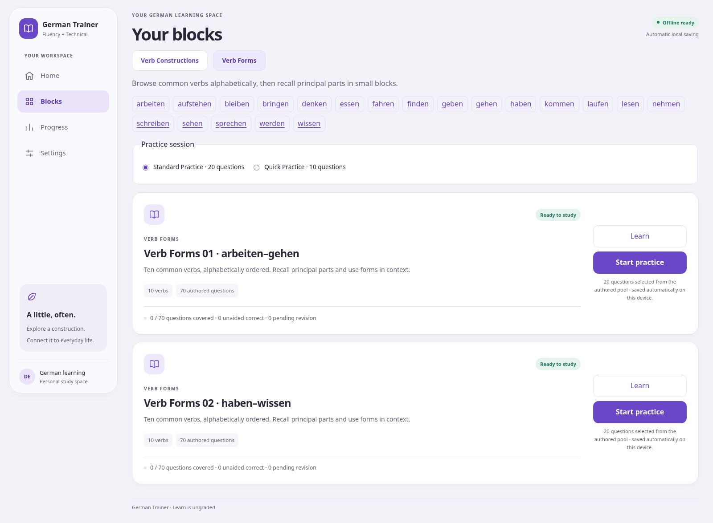
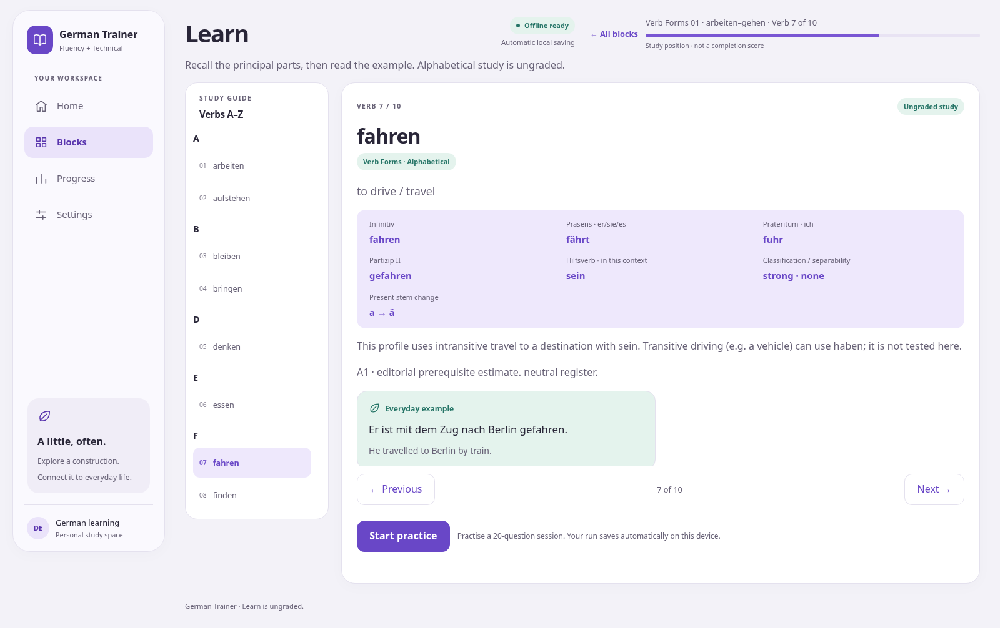
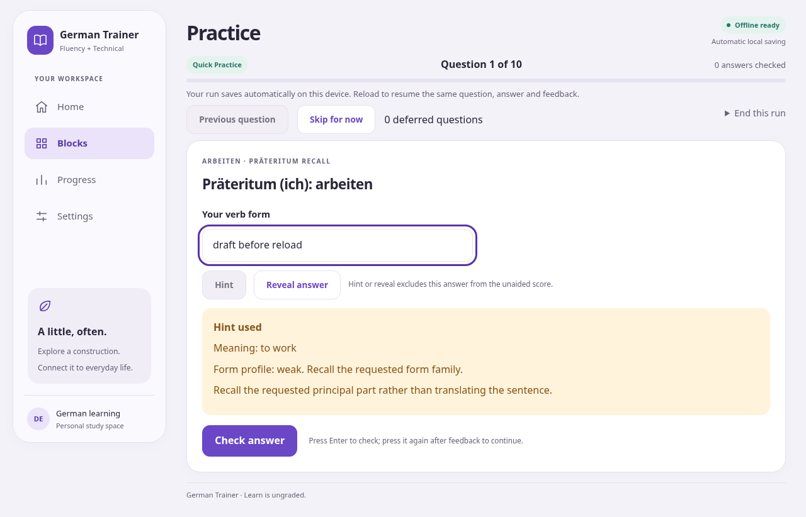
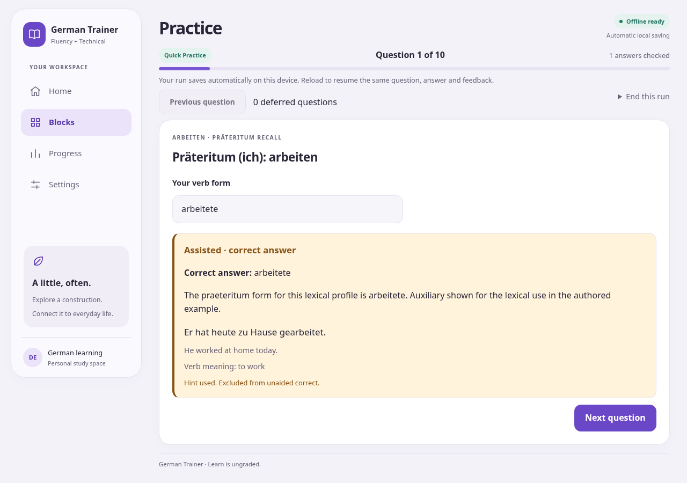
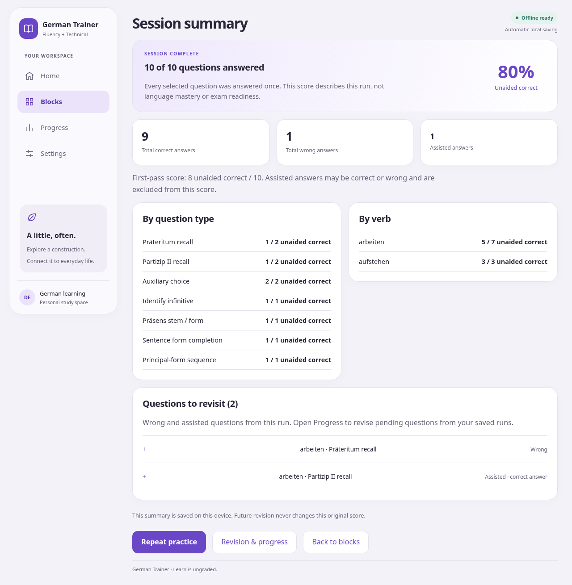
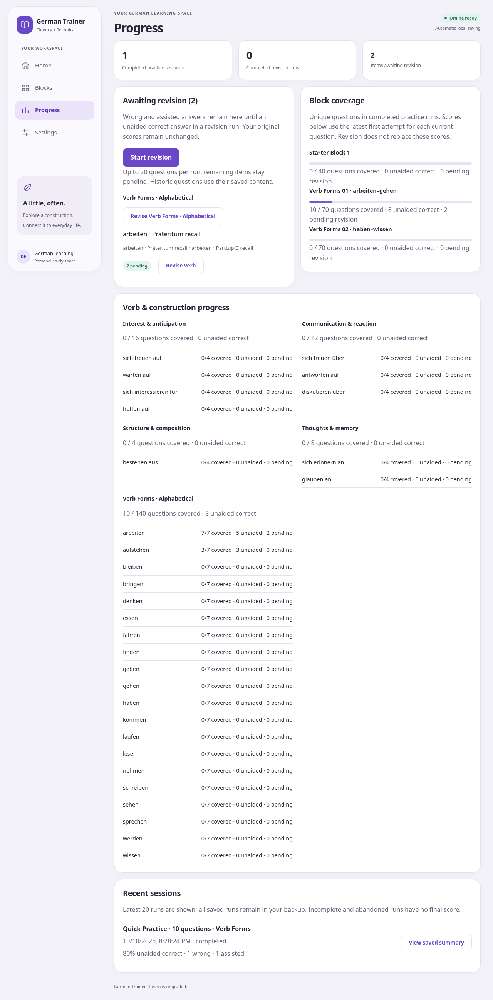
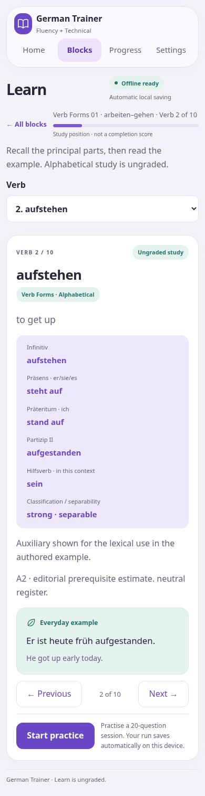

# V2 Verb Forms pilot screenshots

Captured from the production build by `tests/e2e/v2-pilot.spec.ts`, Linux Chromium. Screenshots are full-page, so image height can exceed the viewport. They are visual evidence, not actual-device certification.

Recreate with `npm run test:e2e -- --workers=1 v2-pilot` (Linux cloud uses `PLAYWRIGHT_CHROMIUM_EXECUTABLE_PATH=/usr/bin/chromium`). Tests initially write `test-results/v2-pilot-evidence/`; these copies preserve review evidence across later test runs.

| View | CSS viewport | Screenshot |
| --- | --- | --- |
| Verb Forms block listing | 1600 × 900 | [Blocks](blocks.png) |
| Verb Form Learn | 1600 × 900 | [Learn](learn.png) |
| Verb Form Practice, saved draft and hint | 1280 × 720 | [Practice](practice.png) |
| Verb Form feedback | 1280 × 720 | [Feedback](feedback.png) |
| Verb Form summary, wrong and assisted evidence | 1280 × 720 | [Summary](summary.png) |
| Verb/form revision and category progress | 1280 × 720 | [Progress](progress.png) |
| Phone Learn, separable verb | 390 × 844 | [Phone](phone.png) |

